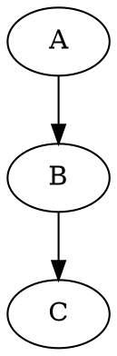

# Gitbook Plugins

# Charting Options | Diagramming Tools

| Diagramming Tool Name | Link| Compatible |
| -- | -- | -- |
| `Kroki` | `Link` | No |
| `JS Sequence` | `Link` | Yes |
| `Flowchart JS` | `Link` |  Yes |
| `JS Code to SVG` | `Link` | No |
| `Mermaid` | `Link` | Confirmed |
| `Superfences` | `Link` | Unknown |
| `Typora` | `Link` | Unknown |
| `UML` | `Link` | Confirmed |
| `GraphViz` | `Link` | Confirmed |


| Charting Tool Name | Link | Compatible |
| -- | -- | -- |
| `Chart JS | `Link` | Unknown |

## FlowChart Example


st=>start: Start:>http://www.google.com[blank]
e=>end:>http://www.google.com
op1=>operation: My Operation
sub1=>subroutine: My Subroutine
cond=>condition: Yes
or No?:>http://www.google.com
io=>inputoutput: catch something...

st->op1->cond
cond(yes)->io->e
cond(no)->sub1(right)->op1


## UML Example 

```uml
@startuml

	Class Stage
	Class Timeout {
		+constructor:function(cfg)
		+timeout:function(ctx)
		+overdue:function(ctx)
		+stage: Stage
	}
 	Stage <|-- Timeout

@enduml
```

## JS Sequence


Alice->Bob: Hello Bob, how are you?
Note right of Bob: Bob thinks
Bob-->Alice: I am good thanks!


## Mermaid


## Codepen

[](codepen://Lingyucoder/AsFJh?height=800&theme=0)

## Graphviz



## Charts / Highcharts


{
    "chart": {
        "type": "bar"
    },
    "title": {
        "text": "Fruit Consumption"
    },
    "xAxis": {
        "categories": ["Apples", "Bananas", "Oranges"]
    },
    "yAxis": {
        "title": {
            "text": "Fruit eaten"
        }
    },
    "series": [{
        "name": "Jane",
        "data": [1, 0, 4]
    }, {
        "name": "John",
        "data": [5, 7, 3]
    }]
}


## Gitbook Rich Quotes


    **Info** Info

    **Note** Note

    > **Tag** Tag

    > **Comment** Comment

    > **Hint** Hint
    > **Success** Success
    > **Warning** Warning
    > **Caution** Caution
    > **Danger** Danger
    > **Quote** Quote

## Swimlanes


  
Title: Simple example

One -> Two: Message

note:
**swimlanes.io** is a simple online tool for creating _sequence diagrams_.

Edit the text to the left to update the diagram.

**Copy the url** to save or share the diagram, _note that the url changes whenever you update the diagram_.

Or `Sign in {fa-sign-in-alt}` to create an account and collect all of your diagrams.


Two -> Two: To self

Two -->> Three: _Notification_

Two -> One: `ok`

note: See **[full syntax overview](/gallery/full-syntax)** for more details



dump:

https://codepen.io/desandro/pen/myXdej
https://codepen.io/cdalson/pen/0c8c29830999466cddd349d454fcd39f
https://codepen.io/cdalson/pen/0c8c29830999466cddd349d454fcd39f
https://codepen.io/desandro/pen/btFfG
https://codepen.io/desandro/pen/btFfG